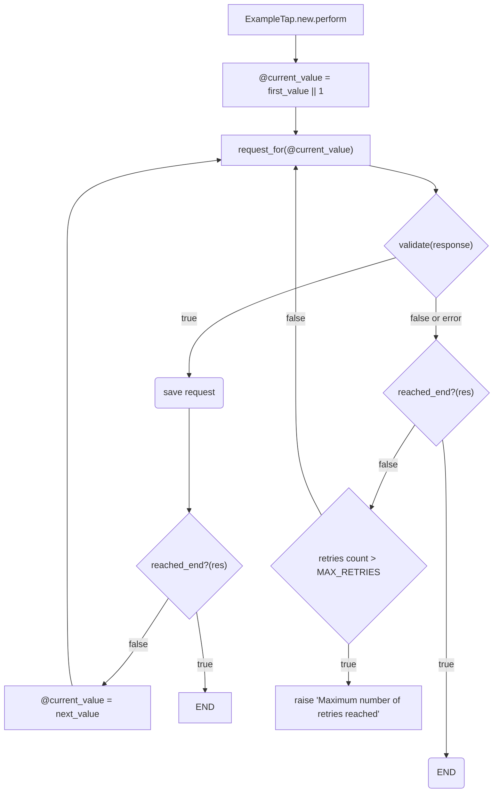

# Extractor
 A Ruby Gem to extract data from apis with mininal configuration
## Installation
 Add this to your Gemfile:
 ```ruby
gem "extractor", github: "felipedmesquita/extractor"
 ```
Create the requests model:
```bash
rails generate extractor:requests
rails db:migrate
```
To get newer changes from the main branch run `bundle update extractor`

## Usage
Create a tap:
```bash
rails generate extractor:tap example
# => create  app/extractors/example_tap.rb
# => create  app/sql/example.sql
```
Taps inherit the initilizer and perform methods from Extractor::Tap. To run our example tap, we can simply call:
```ruby
ExampleTap.new.perform
```
This will download all posts from jsonplaceholder as requests.
To clean up and analize the response contents, check out [dbt](https://github.com/felipedmesquita/dbt)

## How it works
The perform method takes no arguments and just runs until reached_end? returns true for any response received. It also handles retries when responses don't pass validation. Here's a flowchart with the specifcs. Please open a pr if you can untangle this mermaid chart.



## Working with an array parameter
When the value needed to build requests comes from a list (like ids or product codes), you can pass an array to the initializer as the first argument as in `ProductsTap.new(skus).perform`. This changes the behavior of the perform function so that instead of calling `resquest_for` with values counting up from 1, it passes each item of the array one by one. This also makes defining a `reached_end?` method unnecessary, `perform` ends when it has successfully saved a request for each array item.

#### Handling multiple array items per request
Define a method like `request_for_20_values` to better utilize APIs that suport retrieving multiple items per request, then build the request using the array received:
```ruby
def request_for_20_values values
  Typhoeus.get "imaginaryapi.com/products?ids={values.join ','}"
end
```

## Working with a custom parameter
The first argument of the tap's initializer is saved to @parameter and can be any type.

## Authentication
The named parameter `auth:` is saved to instance variable @auth:
```ruby
ExampleTap.new(auth: {seller_id: "23899283", access_token: "jf943u0923nd"}).perform
```
```ruby
def request_for value
  Typhoeus.get "imaginaryapi.com/sellers/#{@auth['seller_id']}/products?access_token=#{@auth['access_token']}"
end
```

## Options
Define these constants to configure retry behavior.
#### Defaults
```ruby
MAX_RETRIES = 4
ON_MAX_RETRIES = :fail
```
`ON_MAX_RETRIES` accepts three possible options:
- `:fail` Default. Raises 'Maximum number of retries reached'
- `:save_to_errors` Saves the last invalid request to the requests table with the extractor_class column set to ExampleTap_errors
- `:skip_silently` Don't use this one.
